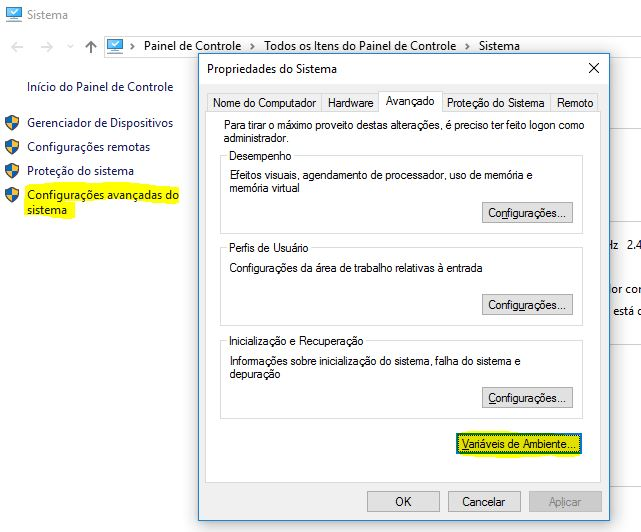
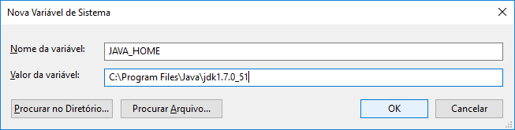

# Instalação do glassfish.
  
O glassfish 3.1 vem com a proposta para instalação no windows de executar e ir seguindo todos os passos (next, next, finish...), geralmente isso não acontece, pois pode ocorrer de não encontrar o JAVA instalado (JDK) na máquina.
Os passos a seguir serão demonstrado todos o itens necessários para instalação do glassfish:
  
** 1. Instalação e configuração da variável de ambiente para o Java. **
  
** Correção na váriavel de ambiente JAVA_HOME **
    Acessar o painel de controle (imagem abaixo), selecione a opção "Configurãções avançadas do sistema", clique no botão "Variaveis de Ambiente", econtre a variavél JAVA_HOME e clique no botão Editar.


  
** 2. Entrar no diretório onde estar o arquivo .exe de instalação do glassfish através do prompt de comando do windows. Neste exemplo o arquivo está no disco 'F:'**

```
F:\Versoes\Tecnologia\Requisitos\Middleware
```
  
** 3. Encontrado o instalador do glassfish para windows execute o camando abaixo, neste comando estamos forçando a instalação buscar o caminho onde o JAVA está instalado utilizando a váriavel de ambiente JAVA_HOME.**
  
```
glassfish-3.1.2.2-windows.exe -j %JAVA_HOME%
```
  
** 4. Poderá ocorrer a mensagem de erro conforme abaixo, quando acontecer basta fazer a alteração na váriavle JAVA_HOME.**
  
```
* Erro na execução da instalação
    Error:'Files\Java\jdk1.7.0_51' is not a valid argument.
  
* Correção na váriavel de ambiente JAVA_HOME
    Acessar o painel de controle (imagem abaixo), selecione a opção "Configurãções avançadas do sistema", clique no botão "Variaveis de Ambiente", econtre a variavél JAVA_HOME e clique no botão Editar.
    Selecione o texto da variável JAVA_HOME e altere incluindo deixando o texto entre aspas e clique no botão OK.
    Atual: C:\Program Files\Java\jdk1.7.0_51
    Alterada: "C:\Program Files\Java\jdk1.7.0_51"
```
  
Feito a alteração na variável de ambiente JAVA_HOME, fechar e abrir o prompt de comando para poder pegar as alterações realizadas, em seguida refaça os itens 2 e 3.
  
Finalizado a instalação deve-se restaurar a variavel de ambiente no formato que estava antes da instalação, para isso refaça o item 3 e retire as aspas.
  
```
Atual: "C:\Program Files\Java\jdk1.7.0_51"
Alterada: C:\Program Files\Java\jdk1.7.0_51
```
  
** (INCLUIR AS TELAS DO PROCESSO DE INSTALAÇÃO DO GLASSFISH) **
  
** 4. A versão 3 do glassfish exige que seja executado o comando abaixo para liberar o login através do usuáiro admin **
  
Acesse o prompt de comando do windows, encontre a pasta de instalação do glassfish e execute o comando: 

```
    
    F:\glassfish3\bin>asadmin enable-secure-admin
    Se houver mais de um dominio deve especificar a porta para login, exemplo:
    asadmin --host localhost --port 5858 enable-secure-admin
```
  
** Os comandos abaixos são para eventuais problemas nas ferramentas da Senior **